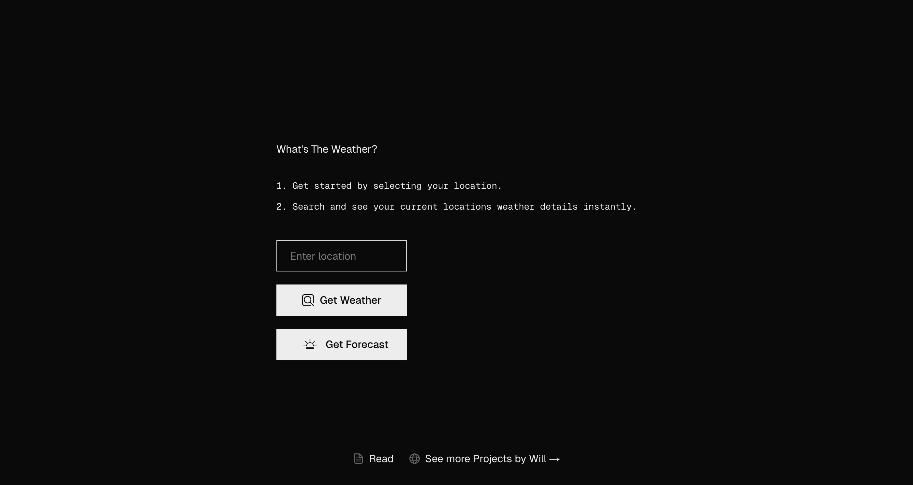
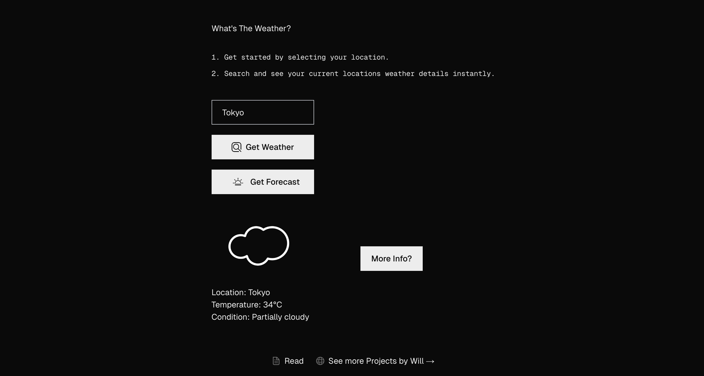
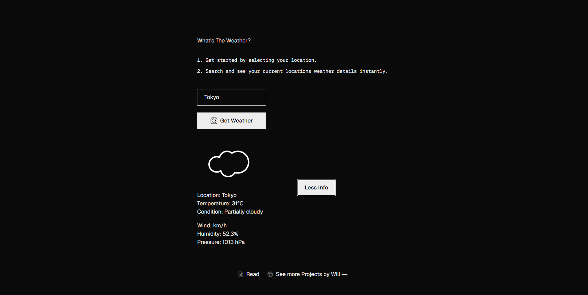
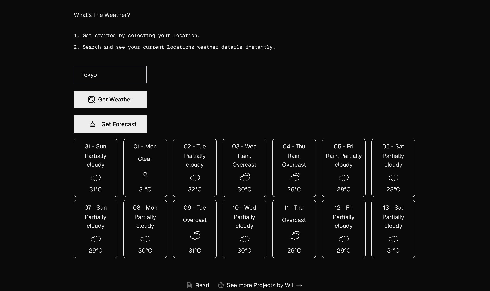

# 🌤 Axoweather – A Full Stack Weather App

This project is a full-stack application built with Google Cloud Services and Redis caching. Users can search for any location worldwide to instantly view its weather details.

🔗 [Live Site](https://weather-app-williamw.web.app/)

## 📚 Table of Contents

- [Features](#-features)
- [Showcase](#-showcase)
- [Tech Stack](#-tech-stack)
- [Web Architecture](#-web-architecture)
- [Project Structure](#-project-structure)
- [Credits](#-credits)

---

## ✨ Features

- Modern, mobile-friendly UI
- Modular, reusable components (search bar, forecast cards, results display)
- Search functionality to look up any location worldwide
- 14-day weather forecast with daily breakdown
- Redis caching (Upstash) for faster API responses
- Clean, responsive layout built with Tailwind CSS
- Backend powered by Firebase Cloud Functions
- Live weather data from Visual Crossing Weather API

---

## 🖼 Showcase

Each of the following pages was designed for usability, layout clarity, and mobile responsiveness.

### 🏠 Home Page

| HomePage                                         |
| ------------------------------------------------ |
|  |

---

### 🔍 Search Result

| Search Result                                    |
| ------------------------------------------------ |
|  |

---

| More Info                                         |
| ------------------------------------------------- |
|  |

---

### 🌤 Forecast

| Forecast                                         |
| ------------------------------------------------ |
|  |

---

## 🛠 Tech Stack

- **TypeScript** – Core application logic and component handling
- **Tailwind CSS & CSS3** – Responsive UI styling and layout
- **Firebase Cloud Functions** – Backend logic (API handling & serverless functions)
- **Firebase Hosting (Google Cloud)** – Frontend hosting and deployment
- **Redis Caching (Upstash)** – Fast API response caching with managed Redis
- **Visual Crossing Weather API** – External weather data provider

## ⚙️ Web Architecture

| Web Architecture                                                    |
| ------------------------------------------------------------------- |
|  |

---

## 📁 Project Structure

```
weather-api/
├── front-end/                # Next.js frontend (ui, pages, components)
│
├── functions/                # Firebase backend (Cloud Functions)
│   ├── src/
│   │   ├── index.ts          # Main entry for Cloud Functions
│   │   └── lib/
│   │       ├── redis.ts      # Redis (Upstash) connection + caching logic
│   │       └── weather.ts    # Weather API calls (Visual Crossing)
│   ├── lib/
│
├── .env                      # Not used anymore, set via cli since fuctions v2
├── .firebaserc               # Firebase project configuration
├── firebase.json             # Firebase Hosting + Functions config
├── package.json              # Project dependencies
├── package-lock.json
├── tsconfig.json
├── .gitignore


```

---

## 🌟 Credits

- **Design & Development:** William Wells
